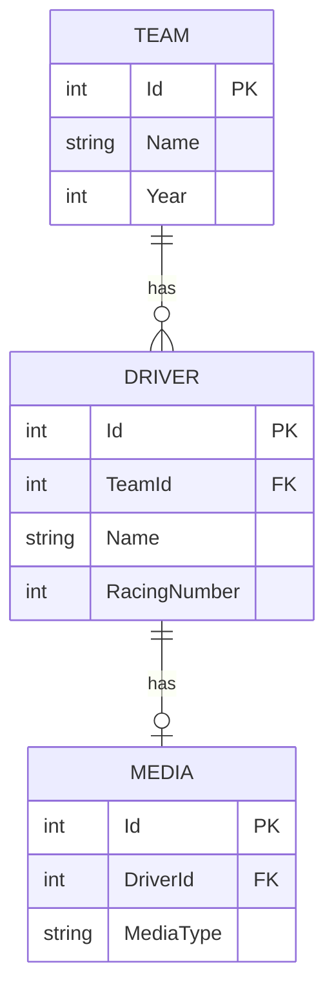

# Follow a request through the Teams API

This is a compact historical C# sample. Its useful part is the relationship between HTTP endpoints, EF Core entities and a PostgreSQL schema.

## The implemented HTTP contract

| Request | Behaviour |
| --- | --- |
| `GET /Teams` | Calls `Teams.All()` and returns a team collection |
| `GET /Teams/{id}` | Looks up an integer primary key; returns 404 when absent |
| `POST /Teams?name=Example&year=2026` | Creates a team, saves changes and returns 201 with a Location header |

The POST action accepts query parameters, not a JSON DTO. There are no team update/delete endpoints. Driver and media models are included, but corresponding HTTP controllers are not.

[requests.http](../requests.http) contains requests you can send after configuring the local database. Adjust the base URL to the server output.

## Trace the create operation

1. [TeamsController.cs](../Controllers/TeamsController.cs) constructs a `Team`, sets UTC creation/modification dates and sets its status.
2. [GenericRepository.cs](../Services/GenericRepository.cs) adds the entity to EF Core's change tracker.
3. [UnitOfWork.cs](../Services/UnitOfWork.cs) commits with `SaveChangesAsync`.
4. PostgreSQL generates the integer identity value defined by the migration.
5. The controller returns `CreatedAtAction` pointing at the lookup endpoint.

`Add` and `CompleteAsync` have separate responsibilities: adding an entity tracks it; saving writes it. The sample exposes this through a unit-of-work wrapper.

## Data relationships

[ApiDbContext.cs](../Data/ApiDbContext.cs) configures the team/driver foreign key with restricted deletion and the driver/media one-to-one relation. The migration is the schema source.

## Assess the sample honestly

`TeamRepo.All` catches a database exception and returns an empty collection. This can make an outage look like an empty result. A maintained service should distinguish those outcomes.

The generic delete/upsert methods are incomplete; the team overrides contain placeholders. The controller does not provide the stronger input validation, pagination, authentication or error contract expected in a production API.

The existing GitHub workflow builds the .NET 6 project. A successful build is compilation evidence, not a database integration test. Modernising the runtime and dependencies is a separate change, as is adding integration coverage against PostgreSQL.
